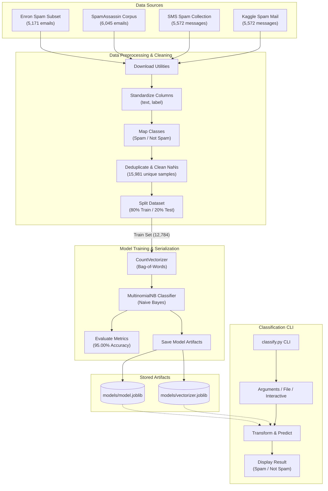

# 📧 AI Spam Email Classifier

A high-performance machine learning classifier that identifies whether email messages are **Spam** or **Not Spam** (Ham). 

This project consolidates **four distinct public corpora** (totaling over 22,000 email and SMS messages) to train a highly accurate classifier. It converts raw email text into numerical representations using a Bag-of-Words model and trains a Multinomial Naive Bayes model.

---

## 🛠️ Technology Stack & Badges


---

## 📐 Pipeline & Architecture

The workflow consists of automated dataset retrieval, column standardisation, deduplication, feature extraction (Vectorization), training, evaluation, and CLI classification.



---

## 🧠 How the AI Model Classifies Text

To understand how this AI model makes predictions, the project implements a standard text classification pipeline:

1. **Text Preprocessing**: Normalizes inputs by converting all characters to lowercase and removing English stop words (common words like "and", "the", "is" that do not add predictive value).
2. **Text Vectorization (`CountVectorizer`)**: Machine learning models require numerical inputs. We use the **Bag-of-Words** approach. It counts the occurrences of each word across all training emails, building a sparse feature matrix where each column is a unique word from the vocabulary, and each row represents an email's word count vector.
3. **Multinomial Naive Bayes (`MultinomialNB`)**: A probabilistic classifier based on Bayes' Theorem:
   \[ P(Class \mid Word_1, Word_2, \dots, Word_n) \propto P(Class) \prod_{i=1}^{n} P(Word_i \mid Class) \]
   It assumes that the occurrence of each word is independent of the others given the class (hence "Naive"). It calculates the probability of each class (Spam or Not Spam) for the input message, returning the class with the highest probability.

---

## 📂 Project Structure

```text
spam-email-classifier/
├── data/
│   ├── combined_dataset.csv     # Deduplicated and consolidated dataset (~15.9k rows)
│   ├── completeSpamAssassin.csv # Cached SpamAssassin corpus
│   ├── spam_ham_dataset.csv     # Cached Enron dataset subset
│   ├── SMSSpamCollection        # Cached SMS Spam Collection
│   └── spam.csv                 # Cached Kaggle Spam Mail dataset
├── models/
│   ├── model.joblib             # Saved Multinomial Naive Bayes model
│   └── vectorizer.joblib        # Saved CountVectorizer vocab representation
├── venv/                        # Python virtual environment
├── classify.py                  # Inference CLI utility
├── train.py                     # Download, cleaning, and model training script
├── requirements.txt             # Project library dependencies
└── README.md                    # Project documentation (this file)
```

---

## 📥 Datasets Conserved

To maximize accuracy and prevent overfitting to a single distribution, the training script downloads, cleans, and merges four public repositories:

*   **Enron Spam Subset**: ~5,171 emails (highly realistic email structures).
*   **SpamAssassin Public Corpus**: ~6,045 emails (complex headers and footers).
*   **SMS Spam Collection (UCI)**: ~5,572 messages (short-form texts and acronyms).
*   **Kaggle Spam Mail Dataset**: ~5,572 messages (general messages).

The merged corpus of **22,360 raw rows** is cleaned and deduplicated to **15,981 unique samples** (76.89% Not Spam, 23.11% Spam).

---

## 🚀 Setup & Installation

### 1. Prerequisites
Ensure you have **Python 3.8+** installed on your system.

### 2. Setup Virtual Environment
Create and activate an isolated Python environment:

```powershell
# Create the environment
python -m venv venv

# Activate the environment
# Windows:
.\venv\Scripts\Activate.ps1
# Linux/macOS:
source venv/bin/activate
```

### 3. Install Dependencies
Install the required packages listed in `requirements.txt`:

```bash
pip install -r requirements.txt
```

---

## 💻 Usage Guide

### 1. Run Model Training
Execute `train.py` to download the datasets, clean and combine them, perform the train-test split, vectorize text, and serialize model artifacts:

```bash
python train.py
```

*This will generate the trained model inside the `models/` directory.*

### 2. Run Classification Queries
Run `classify.py` to evaluate messages. You can use three distinct modes:

#### A. Interactive Loop (Default)
Enter the interactive shell by running the script without flags:
```bash
python classify.py
```
- Paste your message block.
- Press **Enter on an empty line** to classify.
- Type `exit` or `quit` to leave the shell.

#### B. Direct Message Input
Classify a message directly from the command line:
```bash
python classify.py -m "Urgent: Claim your inheritance of 1,000,000 USD now by clicking here!"
```

#### C. Read from a Text File
Classify message body saved in a local text file:
```bash
python classify.py -f path/to/email.txt
```

---

## 📈 Model Performance & Metrics

Validation results on the 3,197 unseen test samples:

- **Validation Accuracy**: `95.00%`

### Classification Report

| Class | Precision | Recall | F1-Score | Support |
| :--- | :--- | :--- | :--- | :--- |
| **Not Spam** (Ham) | 0.98 | 0.96 | 0.97 | 2458 |
| **Spam** | 0.87 | 0.92 | 0.90 | 739 |

### Confusion Matrix

- **True Negatives** (Not Spam predicted as Not Spam): `2,354`
- **False Positives** (Not Spam predicted as Spam): `104`
- **False Negatives** (Spam predicted as Not Spam): `56`
- **True Positives** (Spam predicted as Spam): `683`

---

<sub>Made with love by [Dhanish Ladwani](https://github.com/dhanish0711/)</sub>
